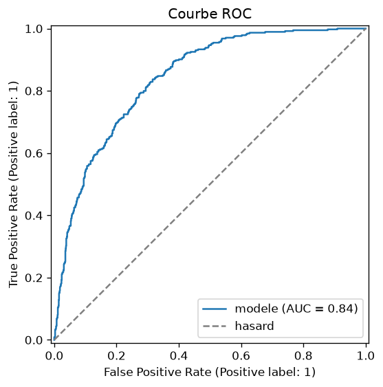
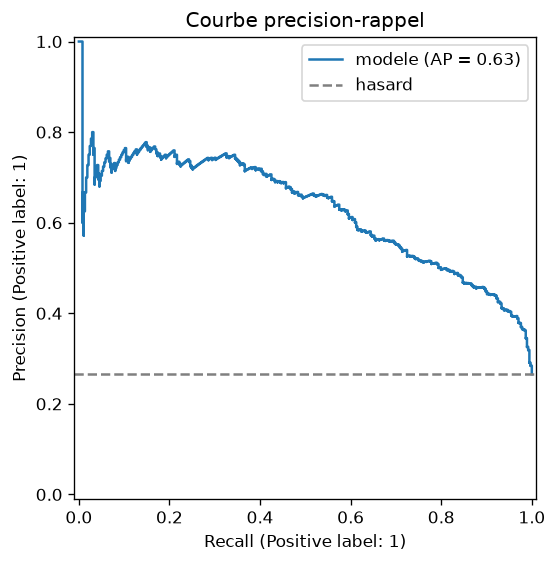
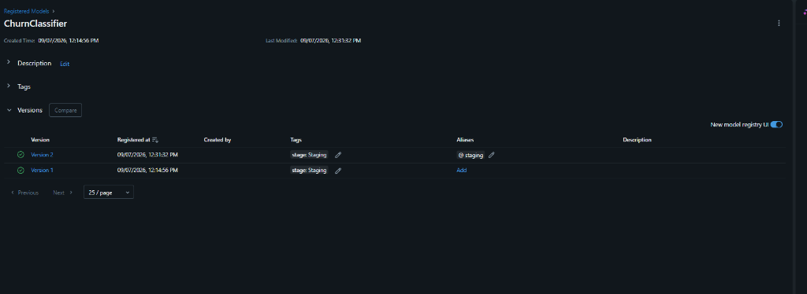

# Customer Churn Prediction — End-to-End MLOps Pipeline

[](https://github.com/YanisHDD/mlops-churn-pipeline/actions/workflows/ci.yml)
[](https://www.python.org/)
[](https://mlflow.org/)
[](https://fastapi.tiangolo.com/)
[](https://scikit-learn.org/)

Projet MLOps complet pour la classification de churn client sur le jeu **Telco Customer Churn**.
Ce depot implemente un pipeline scikit-learn entierement reproductible, un suivi rigoureux des experiences avec **MLflow** (parametres, metriques, artefacts et Model Registry sur base SQLite), ainsi qu'un microservice d'inference **FastAPI** conteneurise avec **Docker**.

---

## 1. Demarrage Rapide

```bash
git clone https://github.com/YanisHDD/mlops-churn-pipeline.git
cd mlops-churn-pipeline

make init        # venv + dependances figees dans requirements.txt
make data        # telecharge data/raw.csv (7 043 clients, 21 colonnes)
make train       # GridSearchCV + suivi MLflow + Model Registry (alias staging)
make evaluate    # courbes ROC/PR, matrice de confusion, predictions -> reports/
make test        # 19 tests unitaires et d'integration (pytest)
make ui          # interface MLflow : http://localhost:5000
make serve       # API FastAPI : http://localhost:8000/docs
```

La commande `make help` liste l'ensemble des cibles disponibles et documentees.
Chaque cible peut egalement etre executee directement via Python depuis la racine, par exemple :
`python -m src.train --config configs/config.yaml`.

---

## 2. Architecture du Projet

```text
mlops-churn-pipeline/
├── .github/
│   └── workflows/
│       └── ci.yml               # Pipeline CI GitHub Actions (qualite + pipeline bout en bout)
├── configs/
│   └── config.yaml              # Configuration centralisee (donnees, features, hyperparametres)
├── data/                        # Donnees brutes (telechargees par make data, non versionnees)
│   └── raw.csv
├── reports/                     # Artefacts d'evaluation (courbes versionnees, CSV non versionnes)
│   ├── confusion_matrix.png
│   ├── roc_curve.png
│   ├── pr_curve.png
│   ├── classification_report.txt
│   └── metrics.json
├── src/
│   ├── __init__.py
│   ├── download_data.py         # Telechargement reproductible du jeu Telco Churn
│   ├── pipeline.py              # Construction du Pipeline scikit-learn & ColumnTransformer
│   ├── train.py                 # Entrainement baseline ou GridSearchCV, Model Registry
│   ├── evaluate.py              # Evaluation finale, generation des graphiques et metriques
│   ├── predict.py               # Inference batch en ligne de commande sur fichier CSV
│   └── utils.py                 # Fonctions utilitaires, coercition de types, split, MLflow
├── service/
│   ├── __init__.py
│   ├── app.py                   # Microservice FastAPI (/health, /predict, /predict/batch)
│   └── Dockerfile               # Image Docker de production pour l'API
├── tests/
│   ├── __init__.py
│   ├── test_pipeline.py         # Tests du pipeline et de la grille d'hyperparametres
│   ├── test_utils.py            # Tests de coercition, robustesse aux NaN et split stratifie
│   └── test_service.py          # Tests de l'API FastAPI et validation Pydantic
├── artifacts/                   # Modeles entraines serialises (non versionnes)
│   └── model.joblib
├── docs/
│   └── images/                  # Captures d'ecran de l'interface MLflow (Model Registry)
├── .dockerignore
├── .env.example                 # Variables d'environnement MLflow et chemins
├── .gitattributes               # Normalisation des fins de ligne (LF)
├── .gitignore
├── Makefile                     # Automatisation complete des taches
├── pyproject.toml               # Configuration des outils (Ruff linter, Pytest)
├── requirements.txt             # Dependances figees avec versions exactes
└── README.md                    # Documentation technique du projet
```

---

## 3. Pipeline scikit-learn & Pretraitement

L'ensemble des etapes de pretraitement est encapsule **au sein du `Pipeline`** via un `ColumnTransformer`. Cela garantit que les transformations statistiques sont apprises exclusivement sur l'ensemble d'entrainement (aucune fuite de donnees / data leakage) et appliquees de maniere rigoureusement identique en phase d'inference :

| Type de colonne | Colonnes | Transformation |
|---|---|---|
| Numeriques | `tenure`, `MonthlyCharges`, `TotalCharges` | `SimpleImputer(strategy="median")` -> `StandardScaler()` |
| Categorielles | 16 variables (genre, services, contrat, facturation...) | `SimpleImputer(strategy="most_frequent")` -> `OneHotEncoder(handle_unknown="ignore")` |
| Estimateur | Toutes | `LogisticRegression(max_iter=1000)` ou `RandomForestClassifier()` |

Le partitionnement des donnees est stratifie (`test_size=0.2`, `random_state=42`) et synchronise entre `train.py` et `evaluate.py`.

Traitements specifiques du jeu de donnees Telco pris en charge dans `utils.coerce_features` :
- Conversion de `TotalCharges` en type numerique flottant (les 11 clients sans anciennete possedant un espace vide sont transformes en `NaN` puis imputes par la mediane).
- Traitement de `SeniorCitizen` (0/1) en tant que variable categorielle.
- Elimination automatique de l'identifiant technique `customerID`.
- Encodage binaire de la cible `Churn` (`Yes` -> 1, `No` -> 0).

---

## 4. Resultats & Metriques

Evaluation realisee sur le jeu de test hold-out (1 409 clients, 26.5% d'attrition) :

| Modele | ROC-AUC (CV) | ROC-AUC (Test) | PR-AUC | Accuracy | Precision | Rappel | F1-Score |
|---|---|---|---|---|---|---|---|
| `baseline-logreg` (defaut) | — | 0.842 | 0.634 | 0.806 | 0.657 | 0.559 | 0.604 |
| `gridsearch-logreg` (C=10.0, liblinear) | 0.846 | 0.841 | 0.628 | 0.805 | 0.655 | 0.559 | 0.603 |

<p align="center">
  
  
  
</p>

La grille exploree (combinaisons de `C` et `solver` sur 5 folds stratifies) confirme la regularite de la regression logistique sur ces donnees. Le rappel de la classe attrition (0.56) peut etre optimise en ajustant le seuil de decision (`--threshold`) selon les contraintes metier.

---

## 5. Suivi des Experiences & Model Registry avec MLflow

Le suivi MLflow repose sur un backend SQLite (`sqlite:///mlflow.db`), obligatoire pour activer le **Model Registry**.
Les variables d'environnement (`.env`, documente dans `.env.example`) priment sur la configuration par defaut.

Chaque execution enregistre :
- **Runs d'entrainement (`baseline-logreg` / `gridsearch-logreg`)** : hyperparametres, metriques de validation croisee via `mlflow.sklearn.autolog`, signature MLflow du modele, exemple d'entree et metriques sur l'ensemble de test.
- **Model Registry** : versionnement automatique sous le nom `ChurnClassifier` avec affectation systematique de l'alias `staging`.
- **Run d'evaluation (`evaluation`)** : metriques detaillees, matrice de confusion, courbes ROC et Precision-Rappel, rapport de classification texte et previsions individuelles (`predictions.csv`).

Lancement du tableau de bord MLflow :
```bash
make ui
# Interface disponible sur http://localhost:5000
```

Chargement du modele directement depuis le registre MLflow :
```bash
python -m src.evaluate --from-registry
```

### Model Registry dans MLflow UI

Visualisation du modele `ChurnClassifier` enregistre avec ses versions successives et l'alias `staging` dans l'interface MLflow :

<p align="center">
  
</p>

---

## 6. Microservice FastAPI (Inference Temps Reel & Batch)

### Demarrage de l'API
```bash
make serve
# Documentation OpenAPI / Swagger sur http://localhost:8000/docs
```

### Exemple de requete d'inference unitaire (cURL)
```bash
curl -X POST "http://localhost:8000/predict" \
     -H "Content-Type: application/json" \
     -d '{
       "gender": "Female",
       "SeniorCitizen": 0,
       "Partner": "Yes",
       "Dependents": "No",
       "tenure": 1,
       "PhoneService": "No",
       "MultipleLines": "No phone service",
       "InternetService": "DSL",
       "OnlineSecurity": "No",
       "OnlineBackup": "Yes",
       "DeviceProtection": "No",
       "TechSupport": "No",
       "StreamingTV": "No",
       "StreamingMovies": "No",
       "Contract": "Month-to-month",
       "PaperlessBilling": "Yes",
       "PaymentMethod": "Electronic check",
       "MonthlyCharges": 29.85,
       "TotalCharges": 29.85
     }'
```

**Reponse JSON :**
```json
{
  "churn_probability": 0.6241,
  "churn": true,
  "label": "Yes"
}
```

Points cles du service :
- Validation stricte des donnees d'entree via Pydantic (`Literal` sur chaque modalite, code HTTP 422 avec explications si modalite inconnue).
- `TotalCharges` optionnel (permet la prise en compte des nouveaux clients avec `tenure = 0`).
- Route batch `/predict/batch` pour le traitement vectorise de multiples requetes.
- Chargement differe du modele avec renvoi explicite du code HTTP 503 si le modele n'a pas encore ete produit.

### Inference Batch en CLI
```bash
make predict
# Scilote data/raw.csv et exporte reports/predictions_batch.csv
```

---

## 7. Tests & Validation de la Qualite

La suite de tests verifie l'ensemble du cycle de vie sans dependre d'un modele pre-existant (des donnees synthetiques et un modele ephemere sont utilises afin de garantir le passage des tests sur un clone vierge) :
- `tests/test_pipeline.py` : integrite de l'architecture, gestion des valeurs manquantes et des modalites inconnues (`handle_unknown="ignore"`).
- `tests/test_utils.py` : conversion des donnees brutes, partitionnement reproductible et calcul des metriques.
- `tests/test_service.py` : points de terminaison `/health`, `/predict`, `/predict/batch` et gestion des codes d'erreur (422, 503).

Execution des tests et du linter :
```bash
make test      # 19 tests unitaires et fonctionnels pytest
make lint      # ruff check . && ruff format --check .
make format    # correction et formatage automatique
```

---

## 8. Integration Continue (CI GitHub Actions)

Le workflow `.github/workflows/ci.yml` s'execute automatiquement a chaque `push` et sur chaque `pull_request` :
1. **Job `qualite` (Lint + tests)** : execution de `ruff` et `pytest` sur un environnement Python 3.12 vierge.
2. **Job `pipeline` (Entrainement + evaluation de bout en bout)** :
   - Telechargement du jeu de donnees (`make data`).
   - Entrainement avec recherche d'hyperparametres et enregistrement MLflow (`make train`).
   - Generation des rapports d'evaluation (`make evaluate`).
   - Televersement des artefacts de rapport (`reports/*.png`, `reports/*.txt`, `reports/*.json`) consultables directement dans l'interface GitHub Actions.

---

## 9. Conteneurisation Docker

L'API de production est prete a etre deployee dans un conteneur leger base sur `python:3.12-slim` :

```bash
# Construction de l'image
make docker-build

# Execution du conteneur
make docker-run
```
L'API est immediatement accessible sur `http://localhost:8000`.
